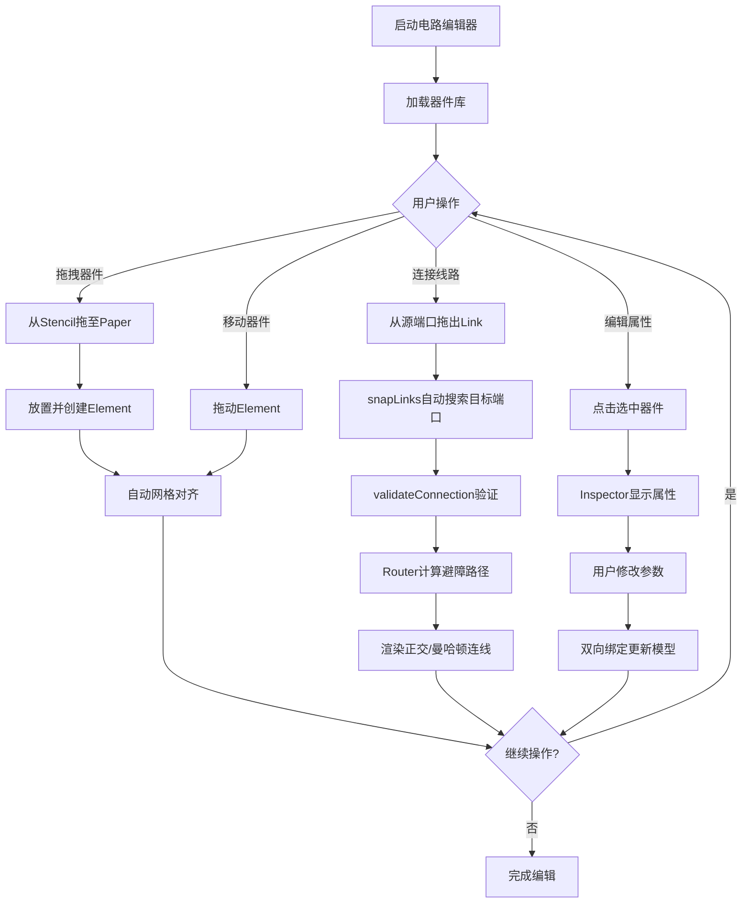

## 1. 产品概述

基于JointJS的Web端交互式电路编辑器，为电子工程师和硬件设计师提供直观的电路原理图绘制工具。支持器件拖拽放置、节点自动吸附、智能连线避障等核心功能，旨在提升电路设计的效率和可视化体验。

目标用户：电子工程师、学生、硬件爱好者
市场价值：提供轻量级、无需安装的在线电路设计解决方案

## 2. 核心功能

### 2.1 功能模块

1. **主编辑区（画布）**：基于JointJS Paper的无限画布，支持缩放、平移、网格吸附
2. **器件面板（Stencil）**：左侧器件库，支持拖拽放置到画布
3. **属性检查器（Inspector）**：右侧属性面板，编辑选中器件的参数
4. **工具栏**：顶部操作栏，提供常用操作按钮

### 2.2 核心特性

| 功能模块 | 特性描述 | 技术实现 |
|---------|---------|---------|
| 器件管理 | 预置电阻、电容、电感、电源、地、二极管、三极管等基础器件 | JointJS自定义Shapes + Stencil组件 |
| 拖拽放置 | 从器件库拖拽器件到画布任意位置 | JointJS Stencil drag-and-drop API |
| 节点吸附 | 器件移动时自动对齐网格；连线时自动吸附到最近端口 | gridSize + snapLinks + validateConnection |
| 智能连线 | 支持直角布线、曼哈顿路由、自动避障 | joint.routers.manhattan / orthogonal |
| 端口系统 | 每个器件定义输入/输出端口，支持多端口 | JointJS Ports API (groups: in/out) |
| 属性编辑 | 修改器件标签、阻值/容值等参数 | JointJS Inspector双向绑定 |

### 2.3 页面结构

| 区域 | 组件 | 功能描述 |
|------|------|---------|
| 顶部 | Toolbar | 缩放控制、清空画布、导出JSON、撤销重做 |
| 左侧 | Stencil | 器件分类展示（无源器件、有源器件、连接点） |
| 中央 | Paper | 主编辑画布，渲染电路图 |
| 右侧 | Inspector | 选中器件的属性编辑 |

## 3. 核心流程

### 用户操作流程

```
用户打开应用 → 浏览左侧器件库 → 拖拽器件到画布 → 移动调整位置（网格吸附）
→ 点击端口开始连线 → 自动吸附到目标端口（智能避障）→ 选中器件修改属性
→ 导出/保存电路图
```

### Mermaid流程图



## 4. 用户界面设计

### 4.1 设计风格

- **主色调**：深色主题（#1a1a2e 深蓝黑背景），科技感
- **强调色**：#0f3460（深蓝）、#e94560（红粉，用于高亮/选中）、#00d9ff（青色，用于连线）
- **器件颜色**：不同类型器件使用不同配色（电阻-橙色、电容-绿色、电感-紫色等）
- **字体**：JetBrains Mono（代码/技术感）+ Inter（UI文本）
- **布局风格**：专业IDE式三栏布局，紧凑高效
- **图标风格**：线性图标，简洁清晰

### 4.2 页面布局

| 区域 | 布局方式 | UI元素 |
|------|---------|--------|
| Toolbar | 固定顶部横条 | Logo、缩放控件(+/-/fit)、操作按钮(清空/导出/撤销) |
| Stencil | 左侧固定宽度260px | 搜索框、分组折叠面板、器件卡片网格 |
| Paper | 中央自适应填充 | 无限画布、网格背景、器件和连线渲染 |
| Inspector | 右侧固定宽度280px | 属性表单、实时预览 |

### 4.3 响应式设计

- Desktop-first（≥1200px）：完整三栏布局
- 平板适配（768px-1199px）：隐藏Inspector，Stencil可收起
- 移动端提示：建议桌面端使用

## 5. 器件清单

### 5.1 基础无源器件

| 器件名称 | 符号描述 | 端口配置 | 默认参数 |
|---------|---------|---------|---------|
| 电阻 | 矩形+引线 | 2端口（左in/右out） | R=10kΩ |
| 电容 | 平行板符号 | 2端口（左in/右out） | C=100μF |
| 电感 | 线圈符号 | 2端口（左in/右out） | L=10mH |

### 5.2 有源器件

| 器件名称 | 符号描述 | 端口配置 | 默认参数 |
|---------|---------|---------|---------|
| 二极管 | 三角+竖线 | 2端口（阳极/阴极） | 型号1N4007 |
| NPN三极管 | 三脚符号 | 3端口（B/C/E） | β=100 |
| 电源 | 圆形+±号 | 1端口（输出） | V=5V |
| 接地 | 三线符号 | 1端口（输入） | GND |

### 5.3 辅助元件

| 器件名称 | 用途 | 端口配置 |
|---------|------|---------|
| 连接点 | 线路分支 | 多端口（4方向） |
| 标签 | 文字标注 | 无端口 |
