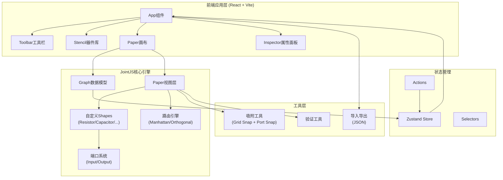
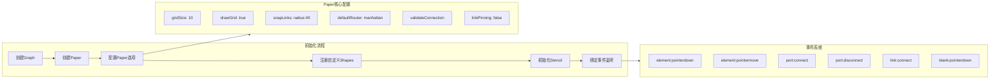
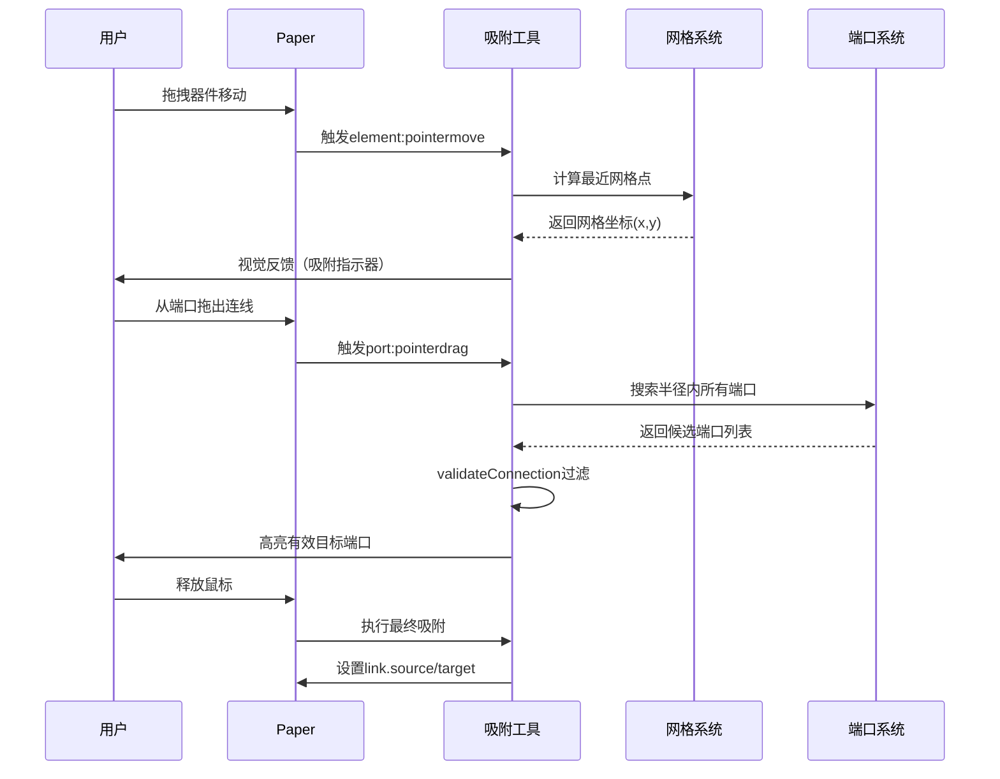
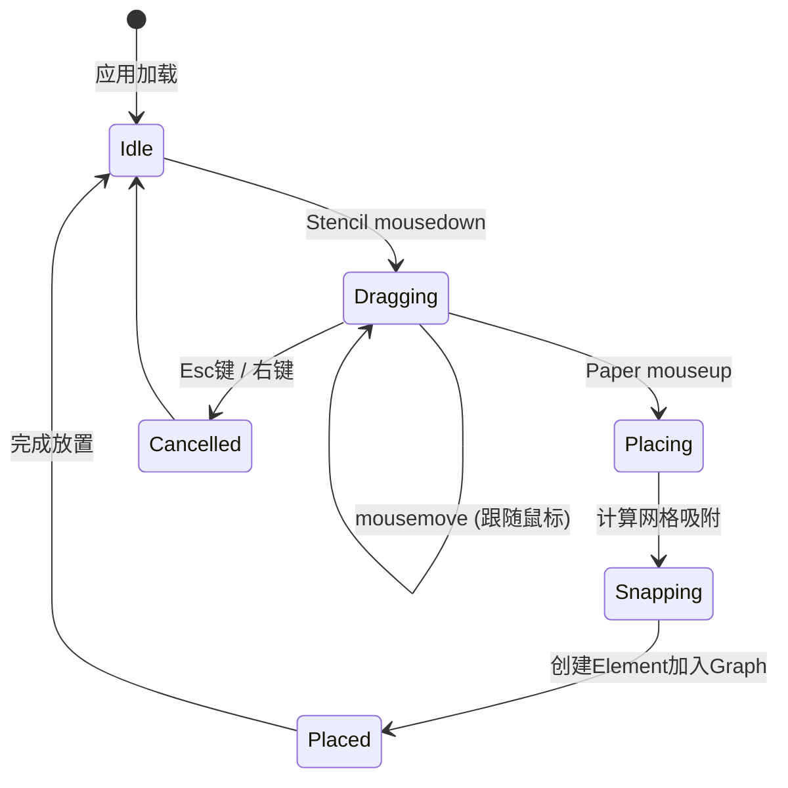
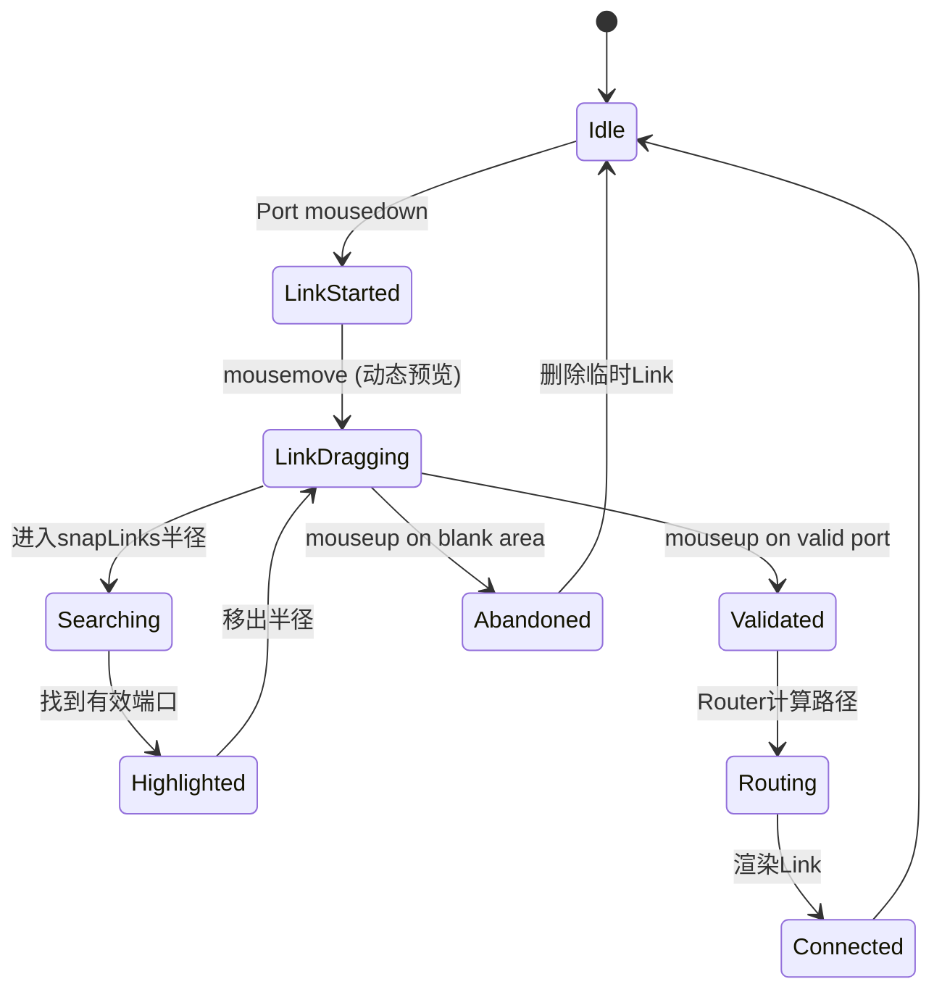

## 1. 架构设计

### 整体架构



### 分层职责

| 层级 | 职责 | 技术 |
|------|------|------|
| **UI层** | React组件渲染、用户交互 | React 18 + TypeScript |
| **引擎层** | 图形渲染、事件处理、路由计算 | JointJS core |
| **模型层** | 数据存储、状态同步 | Zustand + JointJS Graph |
| **工具层** | 吸附算法、导出导入、验证 | 纯函数工具集 |

## 2. 技术选型

### 前端框架
- **React 18** + **TypeScript** - 类型安全、组件化开发
- **Vite 5** - 快速构建、HMR热更新
- **Tailwind CSS 3** - 原子化CSS、快速样式开发

### 核心依赖
- **jointjs@^4.0.0** - 图形引擎（图形、连线、路由、端口）
- **@jointjs-plus/ui** (可选) - 高级UI组件（Stencil、Inspector、Toolbar）
- **zustand** - 轻量状态管理
- **lodash** - 工具函数库（JointJS依赖）

### 开发工具
- **ESLint** + **Prettier** - 代码规范
- **@types/jointjs** - TypeScript类型定义

## 3. 项目目录结构

```
circuit-editor/
├── public/
│   └── index.html
├── src/
│   ├── main.tsx                    # 应用入口
│   ├── App.tsx                     # 根组件
│   ├── components/
│   │   ├── Toolbar.tsx             # 顶部工具栏
│   │   ├── Stencil.tsx             # 左侧器件库
│   │   ├── Canvas.tsx              # 画布容器组件
│   │   └── Inspector.tsx           # 右侧属性面板
│   ├── shapes/
│   │   ├── index.ts                # Shape注册入口
│   │   ├── BaseComponent.ts        # 基础器件类
│   │   ├── Resistor.ts             # 电阻
│   │   ├── Capacitor.ts            # 电容
│   │   ├── Inductor.ts             # 电感
│   │   ├── Diode.ts                # 二极管
│   │   ├── Transistor.ts           # 三极管
│   │   ├── PowerSupply.ts          # 电源
│   │   ├── Ground.ts               # 接地
│   │   └── Junction.ts             # 连接点
│   ├── config/
│   │   ├── stencilConfig.ts        # Stencil配置（器件分组）
│   │   └── paperConfig.ts          # Paper配置（网格、吸附、路由）
│   ├── stores/
│   │   └── useEditorStore.ts       # 编辑器状态管理
│   ├── utils/
│   │   ├── snap.ts                 # 网格/端口吸附算法
│   │   ├── export.ts              # JSON导入导出
│   │   └── validation.ts          # 连接验证规则
│   ├── types/
│   │   └── index.ts                # 类型定义
│   └── styles/
│       └── globals.css             # 全局样式
├── package.json
├── tsconfig.json
├── tailwind.config.js
├── vite.config.ts
└── README.md
```

## 4. 核心模块详细设计

### 4.1 JointJS集成架构



### 4.2 关键配置项

#### Paper配置 (paperConfig.ts)

```typescript
interface PaperConfig {
  // 网格与吸附
  gridSize: 10;                    // 网格大小（像素）
  drawGrid: {                      // 网格样式
    color: '#2a2a4a',
    thickness: 1
  };

  // 连线配置
  defaultLink: () => new CircuitLink();  // 自定义连线样式
  linkPinning: false;              // 禁止连线到空白区域
  defaultConnectionPoint: {
    name: 'boundary'               // 边界连接点
  };

  // 端口吸附
  snapLinks: {
    radius: 40,                    // 吸附半径
    distance: 10                   // 吸附距离阈值
  };

  // 路由配置
  defaultRouter: {
    name: 'manhattan',             // 曼哈顿路由（自动避障）
    args: {
      step: 10,                    // 步长（对齐网格）
      padding: { top: 20, right: 20, bottom: 20, left: 20 }
    }
  };

  // 交互配置
  interactive: {
    vertexAdd: false,              // 禁用手动添加顶点
    vertexMove: false,             // 禁用手动移动顶点
    elementMove: true              // 允许移动元素
  };
}
```

#### 自定义Shape基类 (BaseComponent.ts)

```typescript
abstract class CircuitComponent extends joint.shapes.standard.Rectangle {
  // 所有电路器件的公共属性
  defaults() {
    return {
      ...super.defaults,
      type: 'circuit.Base',
      size: { width: 100, height: 60 },
      attrs: {
        body: {
          fill: '#16213e',
          stroke: '#0f3460',
          strokeWidth: 2,
          rx: 8,
          ry: 8
        },
        label: {
          text: '',
          fill: '#e94560',
          fontSize: 12,
          refX: '50%',
          refY: '50%',
          textAnchor: 'middle',
          textVerticalAnchor: 'middle'
        }
      },
      ports: {
        groups: {
          'in': {
            position: 'left',
            attrs: {
              portBody: { magnet: true, r: 6, fill: '#00d9ff', stroke: '#fff' }
            }
          },
          'out': {
            position: 'right',
            attrs: {
              portBody: { magnet: true, r: 6, fill: '#e94560', stroke: '#fff' }
            }
          }
        },
        items: []  // 子类定义具体端口
      }
    };
  }
}
```

### 4.3 吸附机制设计



### 4.4 连线避障机制

#### 路由策略选择

| 路由器 | 适用场景 | 避障能力 | 性能 |
|--------|---------|---------|------|
| **manhattan** | 复杂电路、多障碍物 | 强（A*寻路） | 中等 |
| **orthogonal** | 简单直角布线 | 弱（仅直角） | 高 |
| **normal** | 直线连接 | 无 | 最高 |
| **one-side** | 单侧布线 | 中等 | 中等 |

**推荐**: 使用 `manhattan` 路由器作为默认配置，配合以下优化：

```typescript
// 路由配置示例
const routerConfig = {
  name: 'manhattan',
  args: {
    step: 10,                    // 步长匹配网格
    maxAllowedDirectionChange: 90,  // 最大转角90度
    padding: 25,                  // 元素间距
    perpendicular: true,         // 允许垂直段
    excludeEnds: ['source', 'target'],  // 排除起终点
    startDirections: ['top', 'bottom'],  // 起始方向
    endDirections: ['left', 'right']     // 结束方向
  }
};
```

### 4.5 Stencil配置

```typescript
// 器件分组配置
const stencilGroups = {
  passive: {
    label: '无源器件',
    index: 1,
    items: [
      { type: 'circuit.Resistor', attrs: { label: { text: 'R1' } } },
      { type: 'circuit.Capacitor', attrs: { label: { text: 'C1' } } },
      { type: 'circuit.Inductor', attrs: { label: { text: 'L1' } } }
    ]
  },
  active: {
    label: '有源器件',
    index: 2,
    items: [
      { type: 'circuit.Diode', attrs: { label: { text: 'D1' } } },
      { type: 'circuit.Transistor', attrs: { label: { text: 'Q1' } } },
      { type: 'circuit.PowerSupply', attrs: { label: { text: 'VCC' } } }
    ]
  },
  auxiliary: {
    label: '辅助元件',
    index: 3,
    items: [
      { type: 'circuit.Ground' },
      { type: 'circuit.Junction' }
    ]
  }
};
```

## 5. 状态管理设计 (Zustand)

```typescript
interface EditorState {
  // 画布状态
  zoom: number;                   // 当前缩放比例
  selectedCellId: string | null;  // 选中的元素ID

  // 图形数据
  cells: joint.dia.Cell[];        // 所有元素和连线

  // 操作历史
  history: HistoryEntry[];
  historyIndex: number;

  // Actions
  setZoom: (zoom: number) => void;
  selectCell: (id: string | null) => void;
  addCell: (cell: joint.dia.Cell) => void;
  removeCell: (id: string) => void;
  updateCell: (id: string, props: object) => void;
  undo: () => void;
  redo: () => void;
  clearCanvas: () => void;
  exportJSON: () => string;
  importJSON: (json: string) => void;
}
```

## 6. 事件处理流程

### 6.1 器件拖放流程



### 6.2 连线创建流程



## 7. 性能优化策略

### 7.1 渲染优化
- **异步渲染**: `async: true` 启用批量DOM更新
- **视口裁剪**: 只渲染可视区域内的元素
- **分层渲染**: Links独立图层，减少重绘

### 7.2 交互优化
- **防抖节流**: pointermove事件节流（16ms/帧）
- **虚拟化列表**: Stencil器件列表虚拟滚动
- **缓存路由结果**: Manhattan路由缓存

### 7.3 内存管理
- **及时销毁**: 删除元素时清理事件监听
- **对象池**: 复用Link和Element对象

## 8. 测试策略

### 8.1 功能测试
- [ ] 器件拖拽放置正确性
- [ ] 网格吸附精度（误差<1px）
- [ ] 端口吸附成功率
- [ ] 连线避障有效性（不穿过器件）
- [ ] 属性编辑双向绑定
- [ ] JSON导出/导入一致性

### 8.2 性能测试
- [ ] 100个器件渲染FPS ≥ 30
- [ ] 50条连线路由计算 < 100ms
- [ ] 内存占用稳定（无明显泄漏）

## 9. 部署方案

### 构建命令
```bash
npm run build        # 生产构建
npm run preview      # 本地预览构建结果
```

### 输出产物
- 静态文件部署（CDN/静态服务器）
- 单页面应用，无需后端服务
- 支持所有现代浏览器（Chrome/Firefox/Safari/Edge）
